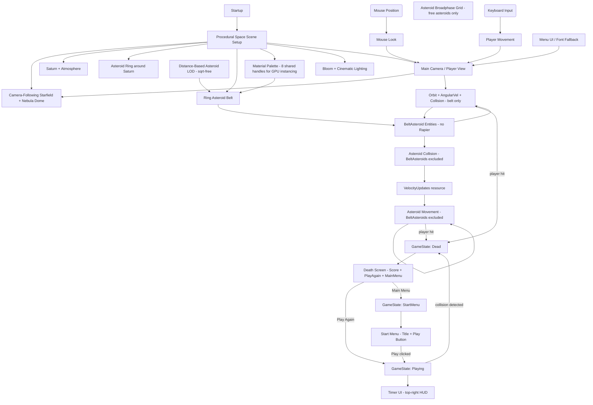

# space_vibe
game project for school, only vibe coding

## Performance Architecture

| Change | Before | After |
|---|---|---|
| GPU draw calls / frame | ~1 080 (unique material per asteroid) | ~50–100 (shared palette → auto-instanced) |
| Rapier physics bodies | 1 080 KinematicPositionBased | **0** (removed entirely) |
| Shadow map pass | All 1 080 meshes | Disabled on ring light |
| Asteroid collision system | Iterates all 1 080 every frame | Skips BeltAsteroids (no-op) |
| Asteroid movement system | Iterates all 1 080 every frame | Skips BeltAsteroids (no-op) |
| Angular velocity updates | All 1 080 / frame | Only within 50 km |
| Player swept-sphere tests | All 1 080 / frame | Pre-culled to < 3 km range |
| LOD distance check | `sqrt()` × 1 080 every 0.2 s | `distance_squared()` (no sqrt) |
| Debug build opt-level | 0 | 1 (3× faster in dev) |