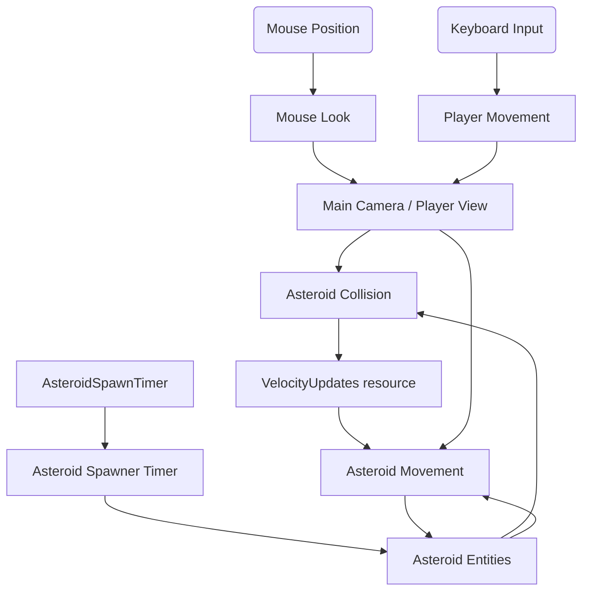

# space_vibe
game project for school, only vibe coding

```mermaid
graph TB
  M(Mouse Position)
  K(Keyboard Input)

  S1[Mouse Look]
  S2[Player Movement]
  S3[Asteroid Spawner Timer]
  S4[Asteroid Collision]
  S5[Asteroid Movement]
  R[Main Camera / Player View]

  RV[VelocityUpdates resource]
  RT[AsteroidSpawnTimer]

  M --> S1
  S1 --> R
  K --> S2
  S2 --> R
  RT --> S3
  S3 --> Ast[Asteroid Entities]
  Ast --> S4
  S4 --> RV
  RV --> S5
  Ast --> S5
  S5 --> Ast
  R --> S4
  R --> S5
```